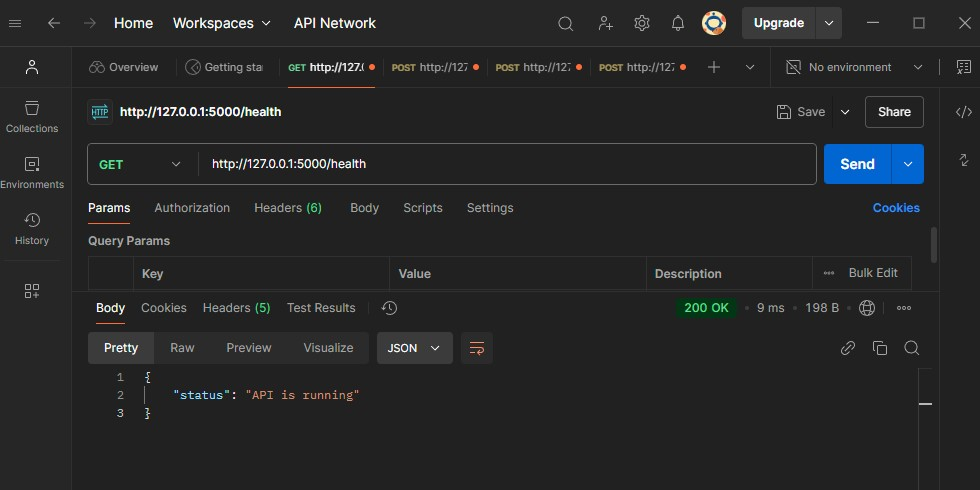
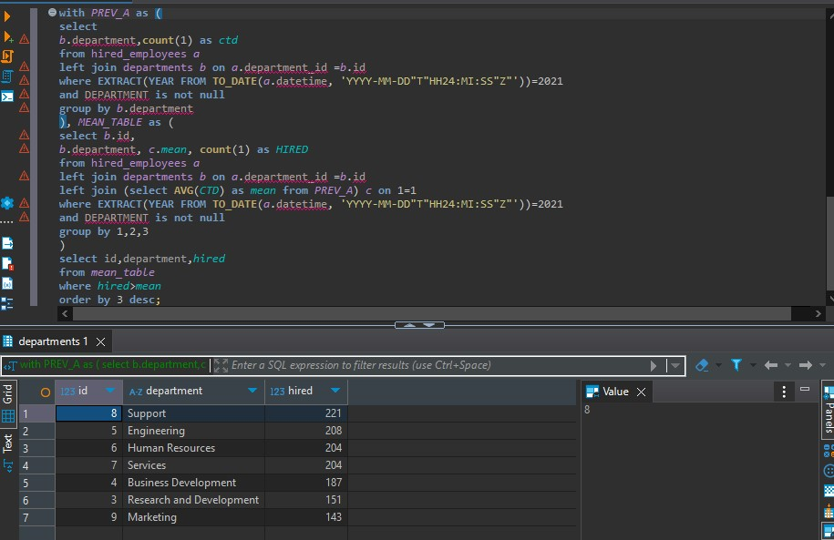

# Globant Coding Challenge Project

The project aims to create a REST API that can load information from CSV files into a relational database. The project is implemented in Python and utilizes cloud services. By this time, I'm using to test the project  `https://www.docker.com/products/docker-desktop/`

## Used Services
- AWS S3
- AWS RDS (PostgreSQL Database)

## Required Python Libraries
- flask
- SQLAlchemy
- boto3
- pandas
- psycopg2

## Folder Structure
- **`main.py`**: Contains the implementation of the API routes (/upload-csv, /batch-insert, /health), and the logic to download CSV files from S3 and upload the data to the PostgreSQL database.
- **`config.py`**: Configuration file where the credentials for connecting to the PostgreSQL database and the AWS S3 access keys are set.
- **`requirements.txt`**: File that contains the dependencies needed for the project
- **`Dockerfile`**: Contains the instructions to build a Docker image to run the Flask application in a container.
- **`docker-compose.yml`** (optional): A file that configures multiple containers and simplifies running the project using Docker Compose.


## Usage

1. Clone the repository and configure your credentials on the config.py file, in a docker terminal run the following command:
```bash
docker build -t test_bc_glob .
```

2. Then run the container with:

```bash
docker run -d -p 5000:5000 test_bc_glob
```

3. Once the project is running, you can test its functionality using Postman:
   - Install Postman: [Download Postman](https://www.postman.com/downloads/)
   - Launch a POST request to `http://localhost:5000/upload-data`

Request example:
```bash
http://127.0.0.1:5000/upload-csv
```

Within the request, the process requires a JSON payload with the following information:
```json
{
   "table": "jobs", // table in the db
   "key_file": "data/Jobs.csv",  // objet key
   "bucket_name": "bcglobantchallengue" // bucket name
}
```

## Execution example

- Docker image build


- Container running


- Testing GET method with postman



- Testing POST method, uploading csv file to "Jobs" table


- Table with the data


- Doing querys to explore the data -- exercises from the challengue, you can see the query on the QuerySection2.sql file





